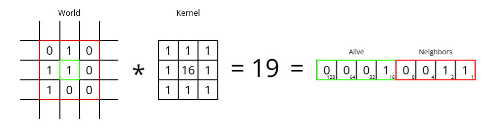

# Cellular Automata

The project is still in development. However, the current version should be functional.

<!-- (Gif?) -->

## TL;DR

CellularAutomata is a simple C++ library for simulating [cellular automaton](https://en.wikipedia.org/wiki/Cellular_automaton "Wikipedia: Cellular Automaton"). It can simulate [discrete](https://en.wikipedia.org/wiki/Conway%27s_Game_of_Life "e.g. Conway's Game of Life") or continuous spaces using convolutions and activations.

## Installation

Copy the header files into an accessible include directory. Since CellularAutomata is a template library, no further installation is necessary.

## Usage

Use `#include <CellularAutomata>` in the main source file. All functions and classes are then available under the namespace 'CellularAutomata'. Examples are provided [here](https://github.com/29th-Day/CellularAutomata/tree/main/example).

### OpenMP

To utilize OpenMP, enable and link OpenMP when compiling the source file. The library uses the `#pragma omp parallel` directive when OpenMP is available.

### CUDA

To utilize CUDA the source file must be compiled using the NVIDIA NVCC compiler. The library uses the `__CUDACC__` macro to detect when CUDA is available.

## Documentation

The doxygen documentation can be found on the [GitHub Page](https://29th-day.github.io/CellularAutomata/) and as comments on the respective functions.


## How it works

In a cellular automaton, each cell utilizes information from neighboring cells and a predefined set of rules to determine its next state. This behavior can be achieved through the use of kernel convolutions and activations. Kernel convolution is an operation that involves placing a small kernel on a larger array to extract features by calculating the sum of element-wise products between the kernel and corresponding array values. An activation function is typically a unary function that transforms the input in a non-linear fashion.

The main advantage of this approach is every set of rules should be able to be implemented using these two building blocks.

### Example: Conway's Game of Life

In [Game of Life (GoL)](https://en.wikipedia.org/wiki/Conway's_Game_of_Life#Rules "Wikipedia: Rules of Conway's Game of Life") the next cell state depends on the surrounding cells within the Moore-Neighborhood. This is achieved using a 3x3 kernel for convolution. Since GoL is a binary system, the kernel values can be defined as follows:



Each cell has 8 dead or alive neighbors and can be either alive or dead. To encode all possible combinations, a minimum of 5 bits (typically 1 byte) is needed. The lower nibble stores the number of alive neighbors, and the higher nibble represents the current cell state.

By using the following activation function, all the rules of the Game of Life are applied.


```
fn life(int x)
{
    int neighbors = x & 0xF; // lower nibble
    bool alive = x & 0xF0;   // higher nibble

    switch(neighbors)
    {
        case 3:
            return 1;
        case 2:
            return (alive) ? 1 : 0;
        default:
            return 0;
    }
}
```

#### Side note

This process is similar to how many filters in image processing or convolutional neural networks operate. Both use kernels to extract relevant information.

## Dependencies

- Compiler supporting C++11

#### Optional

- Compiler supporting OpenMP
- CUDA Toolkit

The project was developed on a Windows 11 machine using MSVC (>19.35), CMake(>3.20) and CUDAToolkit (12.1).

## Objective

To build a project with C++, CUDA, and CMake to deepen my understanding of the entire C++ ecosystem. However, this implementation may not be the most efficient one <!-- blazingly fast :fire: -->, as I deliberately avoid using many pre-built functionalities or libraries (especially for CUDA) in favor of programming out implementations myself. In the future, more efficient implementations may or may not be provided.

## Further information

- EmergentGarden: [Neural Patterns](https://youtube.com/playlist?list=PL_UEf8P1IjTjT9QpNLBsFthMtauaTmOVw "YouTube Playlist")
- 3Blue1Brown: [But what is a convolution?](https://youtu.be/KuXjwB4LzSA "YouTube Video")
- Mordvintsev, et al., "[Growing Neural Cellular Automata](https://distill.pub/2020/growing-ca/ "Scientific paper")", Distill, 2020
